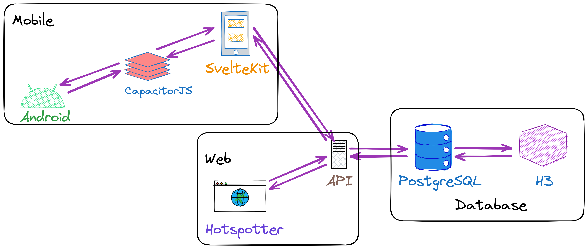

# Hotspotter

> [!WARNING]
> The official paper for Hotspotter is currently pending acceptance and publication into a conference. Until then, it cannot be included nor linked in this repository. Once this is available, the repository will be updated with the relevant links and details.


Hotspotter is an incentivized crowdsensing system that collects, maps, and visualizes WiFi and cellular data to pinpoint hotspots and dead zones for the effective visualization of network coverage.

The system is composed of three subsystems: the database subsystem (PostgreSQL + Uber H3), the web subsystem (SvelteKit), and the mobile subsystem (Android + CapacitorJS + SvelteKit). The Android API enables data collection via the [Fused Location Provider API], the [Telephony Manager API], [WiFi Manager API], and [Google identity providers][google-identity-provider]. More details on the system design can be found in the published paper.

[Fused Location Provider API]: https://developers.google.com/location-context/fused-location-provider/
[Telephony Manager API]: https://developer.android.com/reference/android/telephony/TelephonyManager
[WiFi Manager API]: https://developer.android.com/reference/android/net/wifi/WifiManager
[google-identity-provider]: https://developers.google.com/identity



# Development

The mobile application is a single-page [SvelteKit] application powered by the [Capacitor] runtime for cross-platform WebView-based applications. However, this project only targets the Android platform for now.

[SvelteKit]: https://kit.svelte.dev/
[Capacitor]: https://capacitorjs.com/

## Prerequisites

-   [PostgreSQL]
-   [Node.js]
-   [pnpm]
-   [Android Studio]
    -   `platform-tools`
    -   `platforms;android-34`
    -   `build-tools;34.0.0`
-   [OpenJDK 17]
-   Android 10 (API 28)

[PostgreSQL]: https://www.postgresql.org/download/
[Node.js]: https://nodejs.org/en/download/
[pnpm]: https://pnpm.io/
[Android Studio]: https://developer.android.com/studio
[OpenJDK 17]: https://openjdk.org/projects/jdk/17/

## Development

The following sections explain how to get an instance of the project set up.

### Installing Corepack

We use [Corepack] as the package manager "manager" for Node.js, which should come pre-installed with the default distributions. Corepack is responsible for fetching and proxying the correct version of [pnpm] based on the `packageManager` entry of the [`package.json`](./package.json) file.

[Corepack]: https://nodejs.org/api/corepack.html

```bash
# This command should be available upon installing Node.js.
corepack enable pnpm
```

### Environment Variables

In a `.env` file, populate the following environment variables.

| **Name**                      | **Description**                                                                      | **Required** | **Default** |
| ----------------------------- | ------------------------------------------------------------------------------------ | :----------: | ----------: |
| `MOBILE`                      | If set to `1`, builds the SvelteKit application as a static site for the mobile app. |   &#x274c;   |         `0` |
| `POSTGRES_URL`                | Connection URL to the [PostgreSQL] instance.                                         |   &#x2714;   |
| `PUBLIC_GOOGLE_APP_CLIENT_ID` | The OAuth app client ID for Android from the [Google Cloud console][credentials].    |   &#x2714;   |
| `PUBLIC_GOOGLE_WEB_CLIENT_ID` | The OAuth web client ID from the [Google Cloud console][credentials].                |   &#x2714;   |
| `PUBLIC_HOTSPOTTER_URL`       | The base endpoint for the Hotspotter API.                                            |   &#x2714;   |

[credentials]: https://console.cloud.google.com/apis/credentials

```bash
# Example Configuration
MOBILE=1
POSTGRES_URL='postgres://127.0.0.1/postgres'
PUBLIC_GOOGLE_APP_CLIENT_ID=18878593077-vsfeephdmnr5035916obko0cbjq02djm.apps.googleusercontent.com
PUBLIC_GOOGLE_WEB_CLIENT_ID=18878593077-1mfrpdc8kfs9p5f6fm3ac5lruq1bmpp5.apps.googleusercontent.com
PUBLIC_HOTSPOTTER_URL='https://hotspotter.vercel.app/'
```

### Setting up the Database Utilities

The project uses [PostgreSQL] as the primary database for storing and querying uploaded readings. However, the default installation does not inject the Postgres helper utilities into the `PATH`. To do so, simply add the `C:\Program Files\PostgreSQL\16\bin` folder[^1] to the `PATH`.

[^1]: This is the default installation location. Setups may vary.

```bash
# Running these helper commands should now be available.
postgres --version
initdb --version
psql --version
```

### Disabling the Global Database Service

Note that the default installation adds a background Windows service that hosts the `postgres` server on `127.0.0.1:5342`. Although the global service does make it convenient to get started, we opt to disable the global instance in favor of a more local instance.

Using an **administrator-level** PowerShell session:

```pwsh
$Postgres = 'postgresql-x64-16'
Stop-Service -Name $Postgres
Set-Service -Name $Postgres -StartupType Disabled
```

### Initializing the Local Database

With the global database service disabled, we can now host our own local instance without conflicting on `127.0.0.1:5432`. We start by initializing the `data/` folder in which [PostgreSQL] will store all tables, rows, and columns.

```bash
# Create the `data/` folder.
pnpm db:init

# Start the database server.
pnpm db:start
```

> [!NOTE]
> At this point, the terminal should be hijacked by the database server logs. From now on, we should spawn a new terminal tab to enter more commands. We just leave the database server running in the background. This is effectively what the background service did for us.

We now initialize the database tables and columns with `psql`.

```bash
# Run the `postgres/init.sql` script with `psql`.
pnpm db:migrate
```

### Building the Mobile Application

Recall that the mobile application is a [Capacitor] application that wraps the statically generated web pages by [SvelteKit]. The produced `.html`, `.css`, and `.js` files are effectively what gets loaded as the user interface.

```bash
# Install the dependencies.
pnpm install

# Compile the production build (i.e., with optimizations).
pnpm build
```

> [!WARNING]
> Whenever changes are made to the [SvelteKit] application, the `build/` folder must be rebuilt with the `pnpm build` command. Many hours of debugging can be wasted on outdated build artifacts.

### Signing the Mobile Application

To [sign the release APKs](https://developer.android.com/build/building-cmdline#sign_cmdline), one can generate a 2048-bit RSA private key (valid for 365 days) using the following `keytool` command.

```bash
keytool -genkey -v -keystore android/app/store.jks -keyalg RSA -keysize 2048 -validity 365 -alias hotspotter
```

To [configure Gradle to sign the debug and release APKs](https://developer.android.com/build/building-cmdline#gradle_signing), create a `android/app/keystore.properties` file that contains the following passwords (as previously provided to the `keytool` command).

```ini
storeFile=store.jks
storePassword=
keyAlias=hotspotter
keyPassword=
```

### Installing the Mobile Application

With the `build/` now available, we can now install the application into the Android device. There are two ways to run the application:

-   In the actual device via USB. Ensure that [USB debugging is enabled](https://developer.android.com/studio/debug/dev-options#Enable-debugging).
-   Via the Android emulator. Ensure that the selected system image already contains [Google Play Services](https://developer.android.com/studio/run/managing-avds#system-image) within the latest Android version.

#### Physical Device

```bash
# Find the ID of the connected device via USB.
pnpm run:android --list

# Copy the `build/` into the APK and then
# run the application in the physical device.
pnpm run:android --target $ID
```

#### Android Emulator

```bash
# Copy the `build/` folder into the APK and
# then run the application in an emulator.
pnpm run:android
```

## Code Quality

These are the commands that automate code quality assurance. All `main` code must pass the tests.

```bash
# Check Formatting
pnpm fmt # prettier

# Apply Formatting Auto-fix
pnpm fmt:fix # prettier --write

# Check Linting Rules
pnpm lint:html   # linthtml
pnpm lint:css    # stylelint
pnpm lint:js     # eslint
pnpm lint:svelte # svelte-check

# Check All Lints
pnpm lint
```

# Acknowledgements

This project was developed in fulfillment of the final requirements for the attainment of a Bachelor of Science degree in Computer Science under the [Department of Computer Science], [College of Engineering], [University of the Philippines] [Diliman].

[Department of Computer Science]: https://dcs.upd.edu.ph/
[College of Engineering]: https://coe.upd.edu.ph/
[University of the Philippines]: https://up.edu.ph/
[Diliman]: https://upd.edu.ph/

The following researchers were involved in this year-long project:

* [Sebastian Luis S. Ortiz](https://orcid.org/0009-0007-9631-8708)
* [Justin Gabriel R. Enriquez](https://orcid.org/0009-0005-0203-0179)

The research conducted in this project would not have been possible if it weren't for the following research advisers:

* [Dr. Wilson M. Tan](https://dcs.upd.edu.ph/people/wilson-m-tan/)
* [Dr. Cedric Angelo M. Festin](https://dcs.upd.edu.ph/people/cedric-angelo-festin/)

The [Hotspotter logo](./src/lib/logo/hotspotter.svg) was designed and created by:

* [Angelica Julianne A. Raborar](https://github.com/Anjellyrika)
